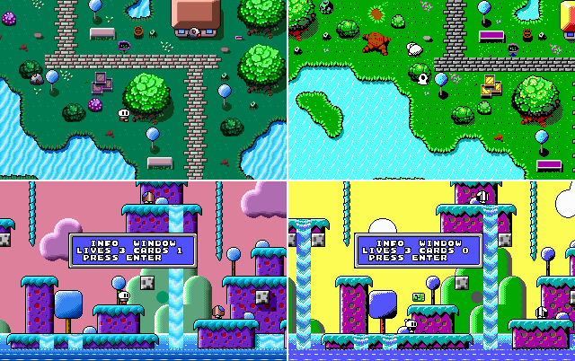

# Little-Game-Engine-for-VGA/EGA
Little Game Engine optimized for CGA/TANDY/EGA/VGA and very slow computers (8088/8086/286)
----------------------------------------------------------------------------



It's 1989, or 1991... (or maybe 1993), and many people can finally experience x86 Personal Computers at a more or less reasonable price... But only second-hand ones, or really low end systems (8088/86, and 286) with (probably) a CGA card, or with some luck an EGA/slow VGA. You also don't have any sound card, (unless the PC is a tandy) or you just got a crappy adlib... This is what happened to me, and many others around me, so this engine is made to work well on those old slow x86 PC's. You won't find mind blowing or undiscovered magical features of old hardware, the only special thing here, is it works well on these first obsolete computers.

Little Game Engine is a very simple "game engine" to create MS-DOS games for slow PCs. It uses CGA/Tandy/EGA/VGA hardware capabilities to run fast, and gets rid of some slow techniques that were used at the time, such as redrawing the entire screen (due to lack of documentation and time... I think).

The engine is now using the more common 320x200 mode, but it has been tweaked to run at 60 Hz on VGA.

NEW:

- Tandy mode working, CGA mode is being added.
- Replaced all turbo C functions with DOS/BIOS functions, this makes the code very small,
and more portable for other DOS compillers.
- Added more compatible scrolling function.
- joystick support


The predefined controls are:
- Move player/menus = UP DOWN LEFT RIGHT arrows or joystick.
- Jump in platform levels = D / button 2.
- Show info window in levels = S / button 1.
- choose option in menu = ENTER / button 1.
- Exit stage/game = ESC.

So. why does it run so fast?
----------------------------

- Uses Hardware scrolling (CGA, Tandy, EGA and VGA have this function, but only EGA and VGA can do 1 pixel smooth scrolling).
- VRAM to VRAM transfers on EGA/VGA (4 pixels at a time on VGA, and 8 pixels on EGA).
- Updates only one column of tiles, and the sprites.
- Very simple "physics".

REQUIREMENTS
------------

I tested the requirements on PCem, and 86Box emulator (they simulate very accurately 8088 CPU's).
Also tested on a 286 at 6 MHz and 8088/NEC V20 from 4.77 to 10 MHz.

                  minimum                              recommended

          CPU: 8088/NEC V20 4.77 MHz          8088/NEC V20 7.16 MHz
          RAM: around 400 Kb                  512 Kb (640 for Tandy Graphics)
          GRAPHICS: CGA                       EGA (128Kb), VGA (256Kb)
          SOUND: PC Speaker                   Tandy / Adlib or OPL2 compatible


Notes about 8088 CPU at 4.77Mhz:

          CGA: Runs slow, sprites will flicker a lot, but engine is playable if music is not enabled.
          Tandy: Runs slow, you should disable music.
          EGA: Can handle only 2 sprites at full speed (16x16).
          VGA: Runs slow.
  
From 286+ CPU, the engine just works ok, even on modern cpu's x86 / x64 (2022) using freedos and any GPU

Little Engine functions:
------------------------

- 320x200 60 FPS MODE, compatible with all cards
- Images in BMP format: 16 / 256 colours bmp, supports RLE compression and color space info generated by modern editors (GIMP).
- Sprites 8x8, 16x16, 32x32, 64x64 sprites (64x64 sprites don't support transparencies).
- TMX maps: Map sizes are fixed 256x19 tiles, created with tiled: https://www.mapeditor.org/
- Graphic print function (8x8 Fonts, 64 characters). Includes latin characters by destroying these: "#$%&\()+-<=>
- Hardware scroll (choppy on CGA/Tandy, smooth on EGA and VGA).
- Palette animation 64+8 colors on VGA, 4 colors on EGA/TANDY (animations for water and similar things).
- Fake Parallax on VGA (64 colors palette animations)
- VGM music for TANDY (SN76496 or compatible) and Adlib (YM3812 or compatible). 

SOUND
-----

To use Tandy or adlib music, just enable Tandy, Adlib or SoundBlaster in the emulator, fpga... or connect an Adlib/SB card to your retro PC.
Create Tandy and Adlib VGM files with any tool you like, there is an awesome tracker called Furnace Tracker that will export VGM files and they 
will work great. VGM files must be around 60 Hz and smaller than 64 KB.

DAT FILES
---------

DAT files are a container which stores multiple smaller files, so program distribution is easier.
DAT files in BIN folder were generated from the files in `ASSETS` folder.
To generate a DAT file, use `makedat` program in `UTIL_DAT` folder (use command line or drag and drop multiple files or a folder).

Install, Make and Run
---------------

Assuming you use DOSBOX to compile:

* Install the required compiler in drive C:
	```
	Borland Turbo C++ 3.0
	Borland Turbo Assembler 2.0 
	```
* SET paths: 
	```
	set PATH=Z:\;C:\TC\BIN;C:\TASM
	```
* Go to BIN folder, and run `makedemo.bat` to make the EXE file.

To create your own game, you only need to modify 'main.c' and compile again, if you want to edit the engine code (LT_LIB.LIB) 
run `makelib.bat` from main folder, to recompile  LT_LIB.LIB.

A lot of code from David Brackeen                                   
http://www.brackeen.com/home/vga/                                     

This is a 16-bit MS-DOS program, it will only work on pure MS-DOS and FreeDos, (maybe on windows 95/98?). It will fail under windows 3.1/11                     
You can compile it in the COMPACT and LARGE memory models. 

Please copy this source code, change it, do whatever you want. That's the point of github. Isn't it?

Thanks to everyone who helped and released code (music player, image loader).
Thanks to "jojo" for sending me a real 286 :).

NOTES
-----
- 	Read source to see how the functions are used in the samples, I tried to leave it as simple as possible.
- 	Little Engine uses 16x16 pixels tiles, and it will split the tilesets in chunks of 16x16 pixels (from left to right / top to bottom).
- 	Sprites are split in chunks of 8x8, 16x16, 32x32, 64x64.
- 	EGA sprites are 16 colour bmp (4 bits per pixel) but they only use 3 colors: 0 = transparent, 1 = black; 2 = white.
- 	Font is a 16 colour bmp (4 bits per pixel) but it only uses 4 colors.
- 	TMX maps must be in CSV format 256x19, orthogonal and must have two layers (background and collision).
- 	All files (tilesets, maps, music and sprites) are limited to 64 kb. 
- 	Only one song, one map and one tileset can be loaded at the same time.
	Doing this, a lot of malloc trouble is fixed, the code is simplified and the engine works like a console.
	So every time you load a map, tileset or music, the last one is overwritten.
-	If a bmp is loaded as an image, map data will be erased.	


-----

"Little Game Engine" optimizado para CGA/TANDY/EGA/VGA y ordenadores/computadoras muy muy lentos (8088/8086/286)
--------------------------------------------------------------------------------------------------


Estamos en 1989, o 1991... (o tal vez en 1993), y mucha gente puede por fin experimentar un ordenador/computadora personal de tipo x86 a un precio mas o menos "razonable". Pero tu PC no es el último modelo, seguramente es de segunda mano, o es un ya obsoleto 8088/86/286, con CGA (con mucha suerte una VGA muy cutre y lenta). Tampoco tienes tarjeta de sonido (a no ser que el PC sea un tandy), o acabas de conseguir una impresionante adlib que alguien ya no quería... Ésto es lo que me ocurrió a mi, y a mucha gente de mi entorno, por eso quise hacer este pequeño sofware enfocado a este tipo de PC. No hay ningun descubrimiento ni ninguna funcion super mágica en este sofware, lo bonito que tiene, es que funcione tan bien en estos primeros PC de gama super baja.

Little game engine es un motor muy simple para crear juegos de MS-DOS que funcionan en PC's muy lentos. Para que funcionase bien, el motor utiliza capacidades hardware de CGA, TANDY, EGA y VGA, y evita técnicas muy lentas utilizadas en su época (por falta de información sobre el funcionamiento de la tarjetas, y falta de tiempo).

El motor usa el modo 320x200, (modificado para funcionar a 60Hz en VGA).


NUEVO:

- Tandy funcionando, CGA en proceso.
- Todas las funciones de Turbo C reemplazadas por funciones de DOS/BIOS, esto hace el programa muy pequeño,
y mas portable a otros compiladores de DOS.
- Añadida función de scroll más compatible.
- Soporte para joystick


Los controles predefinidos son:
- Mover jugador/menus = teclas direccionales / joystick.
- Saltar en el nivel plataformas = D / boton 2.
- Mostrar ventana de información en juego = S / boton 1.
- Elegir opcion en menús = ENTER / boton 1.
- Salir de nivel/juego = ESC. 

Pero... ¿Por qué va tan rápido en PC's tan lentos?.
---------------------------------------------------

- Utiliza la función "scrolling", o movimiento del fondo, incluída en el hardware de las tarjetas CGA, Tandy, EGA y VGA. Aunque solamente EGA y VGA
pueden hacer scrolling suave, pixel a pixel.
- Gracias a la estructura de la Memoria de video (VRAM) del modo X de VGA y de EGA, puedes hacer transferencias de datos de 32 bits, de VRAM a VRAM.
- Sólamente se actualiza una columna de tiles de 16x16 pixels, y los sprites (actualizar toda la pantalla es dolorosamente lento para estos primeros PC). 
- Motor físico súper simple.

REQUISITOS
----------

He probado los requisitos en PCem y 86Box unos emuladores muy precisos. También lo he probado en un 286 real, y algunas personas me han informado de que el motor funciona en otras máquinas reales: 8088/NEC v20 a 9 Mhz; Varias tarjetas VGA y varias Adlib/Sound Blaster parecen funcionar.

                  mínimo                             recomendado

          CPU: 8088/NEC V20 4.77 MHz          8088 7.16 MHz o más rápidas para modo VGA
          RAM: 512 Kb                         640 Kb
          GRÁFICOS: TANDY                     EGA (128Kb), VGA (256Kb)
          SONIDO: PC Speaker                  Tandy / Adlib o cualquiera compatible con chip OPL2

Notas sobre los requisitos mínimos CPU (8088 4.77Mhz):

          Tandy/EGA: El motor mueve como mucho 2 sprites en pantalla (16x16). Más sprites hacen el juego muy lento.
          CGA: Los sprites parpadean y a veces desaparecen. Programar un doble búfer para CGA en este motor no es práctico, así que necesitas 7.16 Mhz.
  

A partir de un modelo 286, funciona en cualquier cpu moderna x86 o x64 (2022) con cualquier tarjeta gráfica.


Funciones de Little Engine
--------------------------

- Modo 320x200 60 FPS, compatible con todas las tarjetas.
- Imágenes BMP: 16 / 256 colores. Soporta compresion RLE y datos de espacio de color generados por apps modernas (GIMP).
- Sprites de 8x8, 16x16, 32x32 y 64x64. Los sprites de 64x64 no soportan transparencia.
- Mapas TMX: Creados con el programa tiled: https://www.mapeditor.org/
- Funcuion print grafica, con fuentes de 8x8, 64 caracteres y caracteres latinos añadidos sobre los siguientes: "#$%&\()+-<=>
- Scroll por hardware de los mapas a 60 fps.
- Animaciones de paleta (64 + 8 colores en VGA; 4 colores en EGA/TANDY). Puedes cambiar colores de la paleta para hacer animaciones.
- Falso segundo plano de "parallax" en VGA, con las animaciones de paleta de 64 colores, puedes simular un falso plano detras del principal.
- Música VGM para el chip TANDY (SN76496 o compatibles) y Adlib (YM3812 o cualquier conpatible). 
	
SONIDO
------

Para utilizar el reproductor de música, símplemente activa la emulación de Tandy, Adlib o Sound blaster en un emulador.
Si tienes un retro PC, conecta una tarjeta Adlib o Sound Blaster o compatible, y listo.

Para utilizar tus propias melodías, recomiendo crear cualquier música con Furnace Tracker, y exportarla a VGM (60 Hz).
Otros VGM funcionarán bien siempre que tengan un tamaño menos de 64KB y 60Hz.

ARCHIVOS DAT
-------------

Los archivos DAT son un contenedor para agrupar muchos archivos pequeños dentro de uno más grande, y así hacer la 
distribución del programa mucho más fácil. 
Los archivos DAT de la carpeta BIN, han sido generados a partir de los contenidos de la carpoeta `ASSETS`.
Para generar un DAT, utiliza el programa `makedat` en la carpeta `UTIL_DAT` (arrastra varios archivos, una carpeta o utiliza la 
línea de comandos).

Instalación, compilar y ejecutar
---------------

Suponiendo que utilizas DOSBOX para compilar:

* Instala el compilador en el disco C:
	```
	Borland Turbo C++ 3.0
	Borland Turbo Assembler 2.0 
	```
* Configura los path: 
	```
	set PATH=Z:\;C:\TC\BIN;C:\TASM
	```
* Ve a la carpeta BIN, y ejecuta `makedemo.bat` para crear el ejecutable.

Para crear tus propios juegos, solamente tienes que modificar 'main.c' y compilar otra vez. Si quieres modificar el motor (LT_LIB.LIB)
ejecuta `makelib.bat` desde la carpeta raiz para recompilar el archivo LT_LIB.LIB.

Un montón de código copiado de David Brackeen                                   
http://www.brackeen.com/home/vga/                                     

Este es un programa de 16-bit, funcionará en MS-DOS puro y FreeDos (tal vez en Windows 95/98. Fallará en windows 3.1/11.                     
Puede compilarlo usando los modelos de memoria "COMPACT" o "LARGE".                        

Este código es complétamente libre, por favor, cópialo, modifícalo, haz lo que quieras con él, para eso lo he puesto en github.

Gracias a todos los que ayudaron o cedieron código (reproductor de música, cargador de imágenes).
Gracias a jojo, por enviarme un 286 real :).

NOTAS
-----
- 	Mira el código para ver como se usan las funciones, he intentado que no sea un desastre.
- 	Little Engine usa tiles de 16x16, y corta los conjuntos de tiles en trozos de 16x16 (de izquierda a derecha y de arriba a abajo).
- 	Los sprites serán divididos en trozos de 8x8, 16x16, 32x32 o 64x64. 
- 	Los sprites para EGA son bmp de 16 colores (4 bits por pixel) y usan los 3 primeros colores: 0 = transparente, 1 = negro; 2 = blanco.
- 	Las fuentes son bmp de 16 colores tanto para EGA como para VGA, y usan solo los 4 primeros.
- 	Los mapas TMX deben estar en formato CSV, ortogonal, tener un tamaño de 256x19 tiles y tener dos capas (fondo y colisión).
- 	Todos los archivos (conjuntos de tiles, mapas, música y sprites) están limitados a 64 kb.
- 	Solamente una música, un mapa y un conjunto de tiles, pueden ser cargados RAM.
	Haciendo esto, se solucionan bugs de malloc, el código se simplifica, y el motor funciona como una consola.
	Es decir, cada vez que cargues un mapa, conjunto de tiles, o una música, la anterior será sobreescrita.
- 	Cargar una imagen bmp sobreescribirá los datos del mapa.
